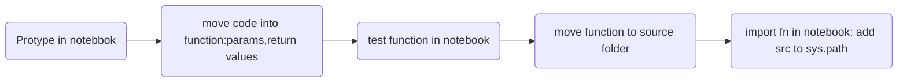

# Read Me!

### build the environment

```
# Create a virtual environment, choose the folder
python3 -m venv <Thesis>

# activate the environmet
source Thesis/bin/activate 

# optional, loading Jupyter notebook
    # install ipykernel
    pip install --user ipykernel
   
    # add virtual environment to Jupyter
    python -m ipykernel install --user --name=<Thesis>
   
# installing requirements
pip install -r requirements.txt

# removing virtual environment after 
deactivate

# removing files
rm -r <Thesis>

	# removing jupyter kernel, list and delete
	jupyter kernelspec list
	jupyter kernelspec uninstall <Thesis>
```

### start coding



### update requirements.txt

```python
pip freeze > requirements.txt
```

### push to version control

```python
git push -u origin RTDev_Jishnu
```


## Structure

```
├── README.md          <- The top-level README for developers.
├── conf               <- Space for credentials
│
├── data
│   ├── 01_raw         <- Immutable input data
│   ├── 02_intermediate<- Cleaned version of raw
│   ├── 03_processed   <- Data used to develop models
│   ├── 04_models      <- trained models
│   ├── 05_model_output<- model output
│   └── 06_reporting   <- Reports and input to frontend
│
│
├── notebooks          <- Jupyter notebooks. Naming convention is
|                         date YYYYMMDD (for ordering),
│                         the creator's initials, and a short `-` 
|                         delimited description.
│
├── references         <- Data dictionaries, manuals, etc. 
│
├── reports            <- Final analysis docs.
│      ├── figures     <- Save the result images
|      ├── report.pdf  <- Documentation
|
├── requirements.txt   <- The requirements file for reproducing the 
|                         analysis environment.
│
├── .gitignore         <- Avoids uploading data, credentials, 
|                         outputs, system files etc
│
└── src                <- Source code for use in this project.
    |
    ├── __init__.py    <- Makes src a Python module
    │
    ├── d00_customFunc.py      <- Functions used across the project
    │   
    │
    ├── d01_data           <- Scripts to reading and writing data etc
    │   └── load_data.py
    │
    ├── d02_intermediate   <- Scripts to transform data from raw to 
    |   |                  intermediate
    │   └── create_int_payment_data.py
    │
    ├── d03_processing     <- Scripts to turn intermediate data into 
    |   |                 modelling input
    │   └── create_master_table.py
    │
    ├── d04_model      <- Scripts to train models and then use 
    |   |                  trained models to make predictions. 
    │   └── train_model.py
    │
    ├── d05_model_evaluation  <- Scripts that analyse model 
    |   |                      performance and model selection.
    │   └── calculate_performance_metrics.py
    │    
    ├── d06_reporting  <- Scripts to produce reporting tables
    │   └── create_rpt_payment_summary.py
    │
    └── d07_visualisation<- Scripts to create frequently used plots
        └── visualise_patient_journey.py
```

